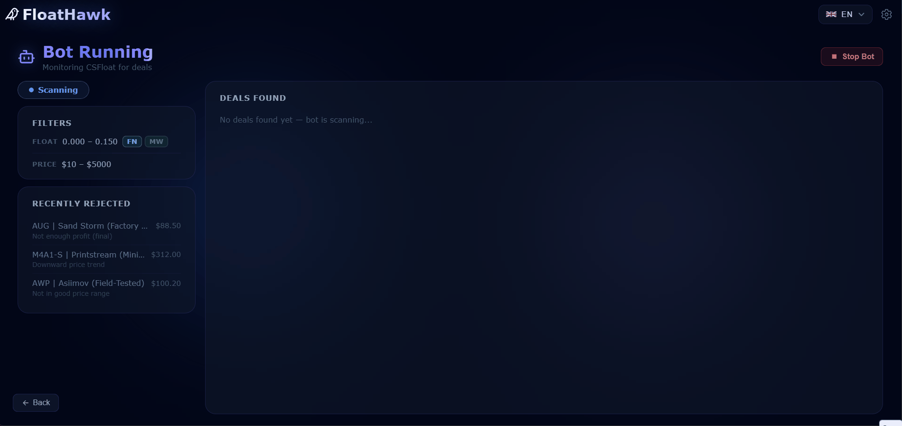
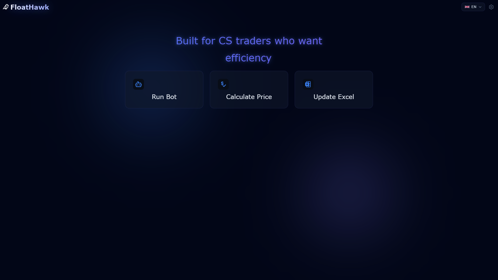
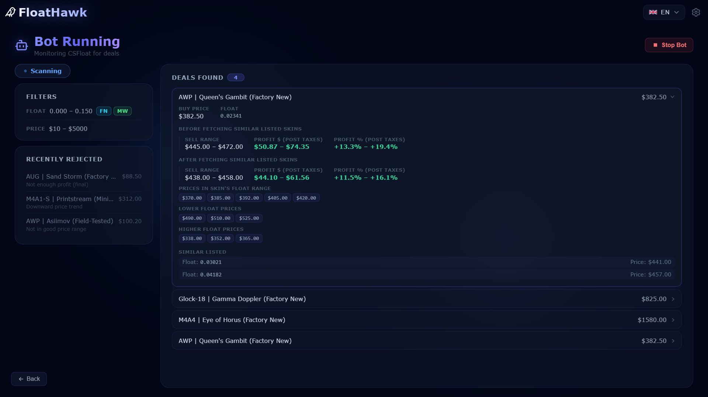
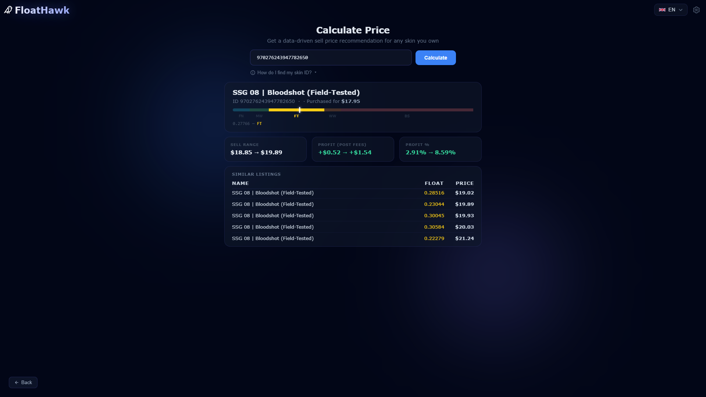
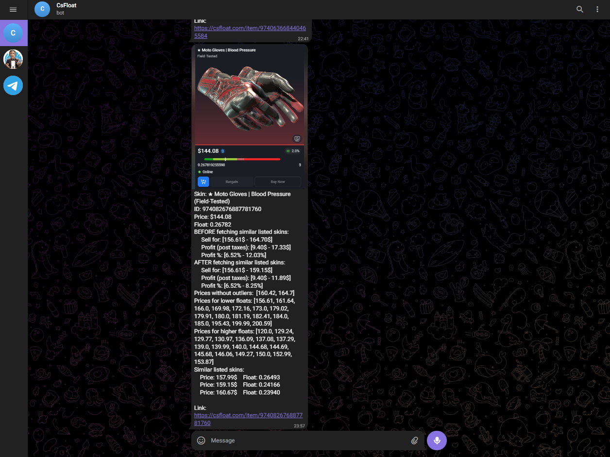

<div align="center">

# FloatHawk

**A desktop app for CS2 skin traders — monitors the CSFloat marketplace in real-time, detects profitable deals with a proprietary algorithm, and alerts you instantly via Telegram.**


</div>

---

## What is FloatHawk?

CS2 skins trade thousands of times per day on CSFloat, and the best deals disappear in seconds. FloatHawk runs 24/7 in the background, scanning every new listing and scoring it against historical price data, float-range competition, and profit margins. When a genuine deal is found, it fires a Telegram notification with an automated screenshot so you can act before anyone else.

Built for commercial distribution — complete with a Windows NSIS installer, DPAPI credential encryption, and PyArmor source obfuscation.

---

## Screenshots



<table>
  <tr>
    <td></td>
    <td></td>
  </tr>
  <tr>
    <td align="center"><em>Home</em></td>
    <td align="center"><em>Live deal dashboard</em></td>
  </tr>
  <tr>
    <td></td>
    <td></td>
  </tr>
  <tr>
    <td align="center"><em>Price calculator</em></td>
    <td align="center"><em>Telegram deal alert</em></td>
  </tr>
</table>

---

## Features

- **Real-time scanning** — polls CSFloat every 10–15 seconds within your configured float range and price limits
- **Proprietary deal validation** — multi-stage algorithm: EMA-smoothed price trend analysis, MAD-based outlier removal, float-range percentile comparison, tier-based profit thresholds
- **Telegram alerts** — Playwright captures a screenshot of the listing; buy price, float, and projected profit sent instantly to your phone
- **Excel trade tracking** — syncs your CSFloat purchase history to a local `.xlsm` workbook with one click
- **Multi-language UI** — Portuguese, English, Spanish, French (react-i18next)
- **Secure credentials** — API keys encrypted with DPAPI via Electron `safeStorage`; algorithm source obfuscated with PyArmor

---

## Tech Stack

| Layer | Technologies |
|---|---|
| Frontend | React 19, Vite, Material UI 9, Framer Motion, react-i18next |
| Backend | Python 3, FastAPI, uvicorn, Playwright, aiohttp, openpyxl, numpy |
| Desktop | Electron 41, electron-store, electron-builder |
| Data | SQLite (deal history), Excel `.xlsm` (trade tracking) |
| Packaging | PyArmor → PyInstaller → electron-builder (Windows NSIS installer) |

---

## Architecture

```
┌──────────────────────── Electron 41 ────────────────────────────┐
│                                                                   │
│   React 19 (Vite)       ◄──── IPC ────►   Electron Main         │
│   MUI · Framer Motion                      safeStorage (DPAPI)   │
│   react-i18next (4 langs)                                        │
│           │                                                       │
│        HTTP + SSE                                                 │
│           ▼                                                       │
│   FastAPI (Python / uvicorn)                                      │
│           │                                                       │
└───────────┼───────────────────────────────────────────────────────┘
            │
     ┌──────┴──────────────────────────────────┐
     ▼                                         ▼
CSFloat Marketplace API             SQLite · Playwright · Telegram Bot
(live listing stream)               (persistence · screenshots · alerts)
```

The Electron shell wraps both layers — spawning the Python backend as a child process in production and injecting credentials as environment variables. A per-session random token (DPAPI-encrypted) secures all HTTP traffic between the two layers.

---

## How It Works

**1. Scan** — The bot polls the CSFloat marketplace every 10–15 seconds, fetching new listings within your configured float range and price limits.

**2. Validate** — Each listing is scored by a proprietary multi-stage algorithm: EMA-smoothed price trend analysis, MAD-based outlier removal, float-range percentile comparison against recent sales, and tier-based profit threshold checks. Listings that fail any stage are rejected immediately.

**3. Alert** — When a deal passes all filters, Playwright launches a headless Chromium session to capture a screenshot of the listing page. The image is sent to your Telegram bot alongside buy price, float value, and projected profit range.

**4. Track** — Every deal is persisted to SQLite. The Update Excel page syncs your full CSFloat trade history to a local `.xlsm` workbook, recording purchase price, sell range, profit in USD and EUR, and marketplace fees.

---

## Getting Started (Development)

> **Note:** Several core files are not included in this repository (see [Proprietary Notice](#proprietary-notice)). Cloning this repo will not produce a runnable application — it is provided for reference only.

### Prerequisites

- Python 3.11+
- Node.js 20+
- npm

### Install

```bash
git clone https://github.com/29goncalo04/floathawk.git
cd floathawk

cd Frontend && npm install && cd ..
cd Electron && npm install && cd ..

pip install fastapi uvicorn requests aiohttp openpyxl playwright numpy
playwright install chromium
```

### Run (3 terminals)

```bash
# Terminal 1 — Python backend (PowerShell)
cd Script
$env:CSFLOAT_API_KEY = "your-api-key"; python Main.py

# Terminal 2 — React frontend
cd Frontend
npm run dev

# Terminal 3 — Electron
cd Electron
npm start
```

> On first run, `Main.py` automatically downloads the Playwright Chromium browser (~100 MB). Subsequent starts are instant.

---

## Proprietary Notice

The following files are not included in this repository — they are the core commercial IP of the product: `deal_validator.py`, `market_utils.py`, `GraphStudy.py`, `profit.py`, `constants.py`, `DiscoverSellPrice.py`, `Timeout.py`, `float_tiers.py`.

The pipeline combines EMA-smoothed price trend analysis, MAD-based outlier removal, float-range percentile comparison against recent sales, and tier-based profit thresholds.

Contact: goncalocruz2910@gmail.com

---

## License

© 2025 Gonçalo Cruz — All Rights Reserved.  
Distributed as a commercial product. Source code in this repository is provided for reference only and may not be copied, modified, or redistributed.
